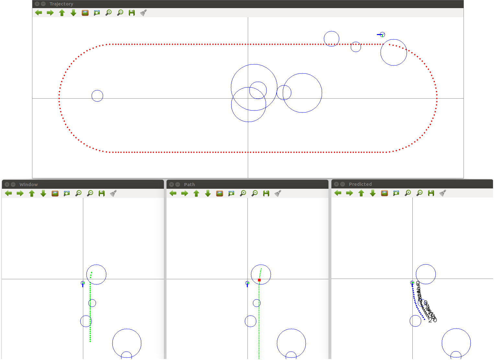

# Kugle-Misc
This repository contains code, libraries and other tools built for the Kugle robot project as part of the master thesis work described in [Kugle - Modelling and Control of a Ball-balancing Robot](https://github.com/mindThomas/Kugle-MATLAB/blob/master/Kugle%20-%20Modelling%20and%20Control%20of%20a%20Ball-balancing%20Robot.pdf), that does not fit in the other repositories, eg. log-processing, periphiral drivers/interfaces, startup scripts etc.

Most importantly this repository includes the real-time test code for the MPC library including obstacle avoidance in [`MPC_Test`](src/MPC_Test).

## How to build
```bash
mkdir build
cd build
cmake ..
make
```

## ACADO dependency
To build and run the `mpc_code_generation` executable [ACADO](http://acado.github.io/) is needed. If not already installed, ACADO Toolkit will automatically be downloaded and compiled by running `cmake`, however ACADO will only be stored in `/tmp` why it will be removed if the PC is restarted.

Alternatively it is recommended to download, compile and install ACADO manually into your home folder:
```bash
cd ~
git clone https://github.com/acado/acado.git -b stable ACADOtoolkit
cd ~/ACADOtoolkit
mkdir build
cmake -DCMAKE_BUILD_TYPE="Release" ..
echo 'source acado_env.sh' >> ~/.bashrc 
source acado_env.sh
```

## MPC simulation
This repository includes tests for the shape-accelerated model predictive controller including obstacle avoidance. The MPC can be simulated (faster than real-time) with a predefined trajectory and visualized with a 2D top-down view. Random obstacles will be generated during simulation. Run the simulation from the `build` folder after compiling.
```bash
./MPC_Test
```

A video of the C++ MPC simulation is shown in the video here: [https://www.youtube.com/watch?v=BJ4jbo7n7VY](https://www.youtube.com/watch?v=BJ4jbo7n7VY&list=PLLtE4m3fKcOC_TuErjgOpTiI3abHPWM0x&index=20)  
[](https://www.youtube.com/watch?v=BJ4jbo7n7VY&list=PLLtE4m3fKcOC_TuErjgOpTiI3abHPWM0x&index=20)